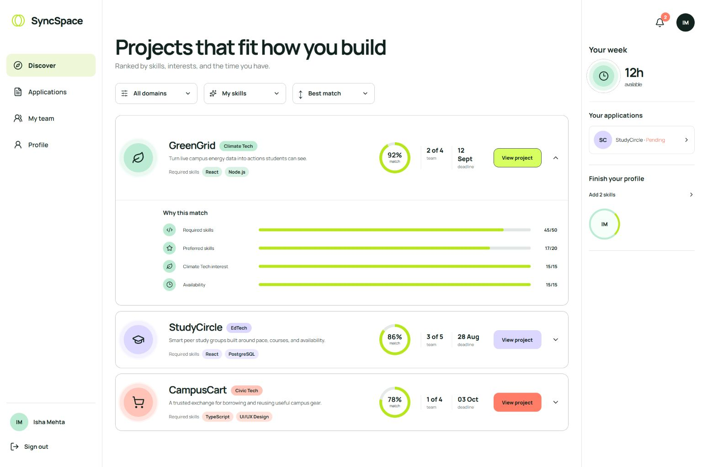

# SyncSpace

SyncSpace helps college students discover worthwhile campus projects and find teammates whose skills, availability, and interests fit the work. Every recommendation is explainable: students see the score components, missing skills, and why a project ranked where it did.



## What is included

- Student and project-owner registration with JWT authentication
- Editable student profiles, skill proficiency, interests, and weekly availability
- PDF resume upload with a review-before-save skill extraction flow
- Project creation, filtering, deadlines, required skills, and preferred skills
- Explainable project recommendations with a weighted score breakdown
- Complementary teammate ranking based on uncovered project skills
- Application review with transactional team creation and capacity enforcement
- Role-based owner dashboard, project publishing, and browser accept/reject controls
- Live student application tracking and dynamic accessible-team navigation
- Team workspace with membership, progress, tasks, assignments, and notifications
- Responsive React interface with a built-in demo data adapter

## Stack

- React 19, React Router, Vite, Manrope, and Lucide icons
- Express 5 with Zod validation, JWT, bcrypt, and Multer
- PostgreSQL with numbered SQL migrations and parameterized queries
- Node's test runner, Vitest, Testing Library, and Supertest
- pnpm workspace with one client and one API service

The detailed system boundaries and data model are in [docs/architecture.md](docs/architecture.md). Each build phase has its own record in [docs/phases](docs/phases/README.md).

## Quick start: interactive demo

The client defaults to demo mode, so the complete interface can be explored without PostgreSQL.

```bash
pnpm install
pnpm dev:client
```

Open `http://localhost:5173`. Use any valid-looking email and a password of at least eight characters, or use a seeded identity such as:

- Student: `isha@northstar.edu` / `demo1234`
- Project owner: `arjun@northstar.edu` / `demo1234`

Demo changes are kept in the browser's local storage. Set `VITE_DEMO_MODE=false` in `client/.env` to use the real API.

## Full local setup

Requirements: Node.js 20+, pnpm 11+, and PostgreSQL.

```bash
cp .env.example .env
createdb syncspace
pnpm install
pnpm db:migrate
pnpm db:seed
pnpm dev
```

The client runs at `http://localhost:5173`; the API runs at `http://localhost:4000`. Copy the root environment values into `server/.env` if your process manager does not load the workspace-root `.env` file.

For Windows PowerShell, use `Copy-Item .env.example .env` instead of `cp`.

## Matching model

Project recommendations are deterministic and use four independently visible components:

```text
score = 50% skill coverage
      + 20% domain/interest alignment
      + 15% availability fit
      + 15% commitment fit
```

Required skills carry more weight than preferred skills. The response also includes the skills already covered, the student's skill gaps, and eligibility reasons. Teammate ranking favors candidates who add skills the current team still lacks, while retaining the same availability and interest signals. The pure scoring module is isolated from PostgreSQL so it can be audited and unit-tested directly.

## Commands

| Command | Purpose |
|---|---|
| `pnpm dev` | Run the client and API together |
| `pnpm dev:client` | Run only the Vite client |
| `pnpm dev:server` | Run only the Express API |
| `pnpm test` | Run API and UI tests |
| `pnpm build` | Create the production client bundle |
| `pnpm db:migrate` | Apply pending PostgreSQL migrations |
| `pnpm db:seed` | Seed colleges, users, skills, and projects |

## Documentation

- [API examples](docs/api.md)
- [Architecture and data model](docs/architecture.md)
- [Visual design system](docs/design-system.md)
- [Verification and fidelity ledger](docs/qa.md)
- [Production deployment and operations runbook](docs/production-runbook.md)
- [College boundary decision](docs/tenant-boundary.md)
- [Phase-by-phase build record](docs/phases/README.md)

## Current deployment status

The public prototype is hosted on Appwrite Sites with its Express API on Render and PostgreSQL plus private object storage on Supabase. Phase 8's owner and application workflow is complete in the repository and will reach the public services after the next GitHub push and successful automatic deployments. See [the deployment status](docs/deployment-status.md) for the live checklist.
