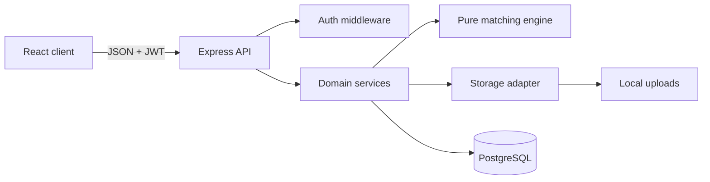
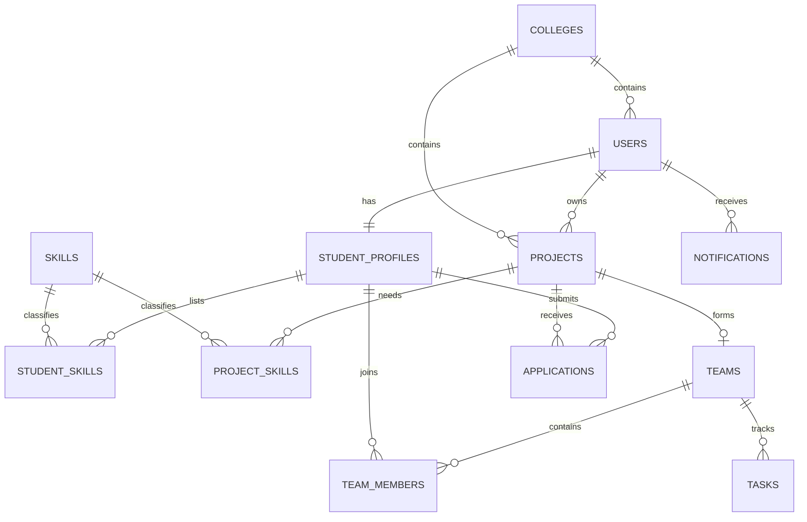

# SyncSpace Architecture

SyncSpace is a pnpm monorepo with a React/Vite client and a single Express API backed by PostgreSQL. The MVP intentionally uses stateless JWT authentication, local resume storage behind an adapter, and polling for notifications.

## Boundaries

- Routes own HTTP concerns and validation.
- Controllers coordinate authorization and domain work.
- Models contain parameterized SQL only.
- The matching engine accepts plain objects and never touches the database.
- Resume storage is accessed through `services/storage.js`, allowing an S3-compatible adapter later.
- `college_id` exists on users and projects for future tenant scoping; no SaaS behavior is implemented in the MVP.

## Data model

## Security baseline

- Passwords are hashed with bcrypt cost 12.
- JWTs are short payloads signed with a deployment secret.
- Every SQL call uses positional parameters.
- Resume uploads are limited to PDFs and stored with generated filenames.
- Owner-only and resource-ownership checks are performed server-side.
