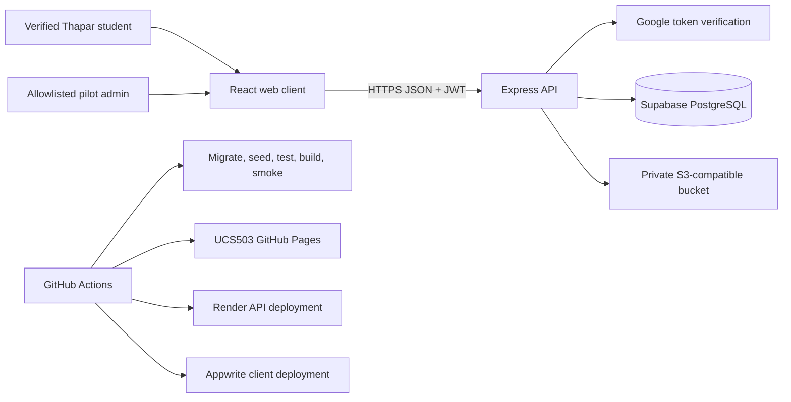
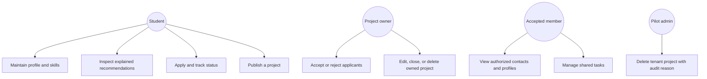
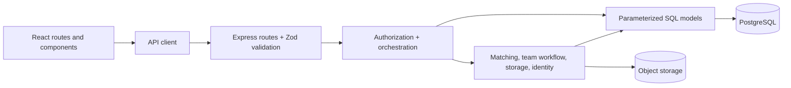
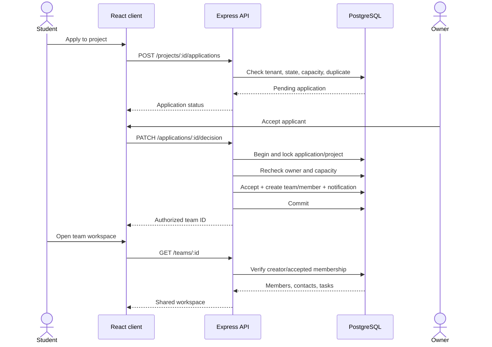
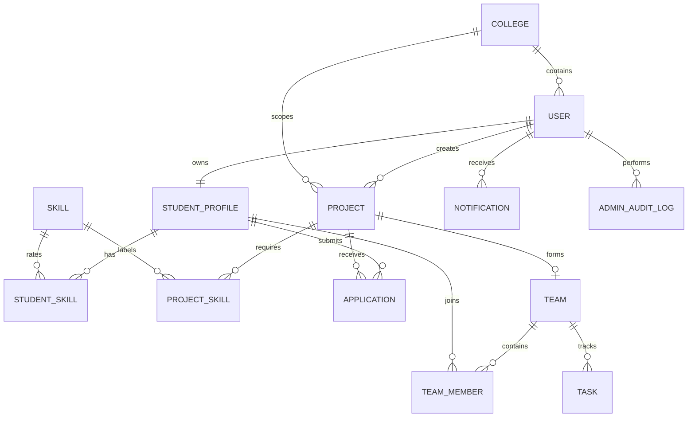

# Architecture and UML

## System context

## Use-case model

Every authenticated account may become both collaborator and owner. The labels describe the actor's relationship to a specific resource, not a permanent user role.

## Container design

Design responsibilities:

- React pages own presentation and user interaction, not permission decisions.
- Routes own HTTP shape and schema validation.
- Controllers enforce resource and relationship authorization.
- Services own multi-step domain workflows and adapters.
- Models contain parameterized queries and explicit transactions.
- The matching engine is pure and accepts plain objects, making score logic independently testable.

## Apply-to-workspace sequence

## Domain model

## Design principles

- **Least privilege:** contacts, profiles, resumes, ownership actions, and admin actions are filtered at the API boundary.
- **Explicit tenancy:** `college_id` is carried through user, project, and relationship queries.
- **Explainability before optimization:** ranking components remain visible and deterministic.
- **Progressive enhancement:** critical landing content remains visible even if WebGL or animation initialization fails.
- **Adapter boundaries:** resume storage can use local disk in development and S3-compatible storage in production.
- **Atomic domain changes:** acceptance, capacity, membership, notifications, moderation audit, and deletion use transactions where partial completion would be unsafe.

The lower-level schema and deployment boundaries are recorded in [Architecture](../architecture.md).
